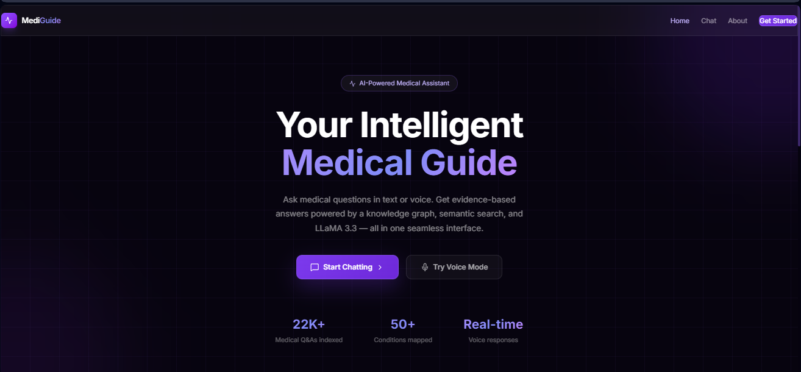
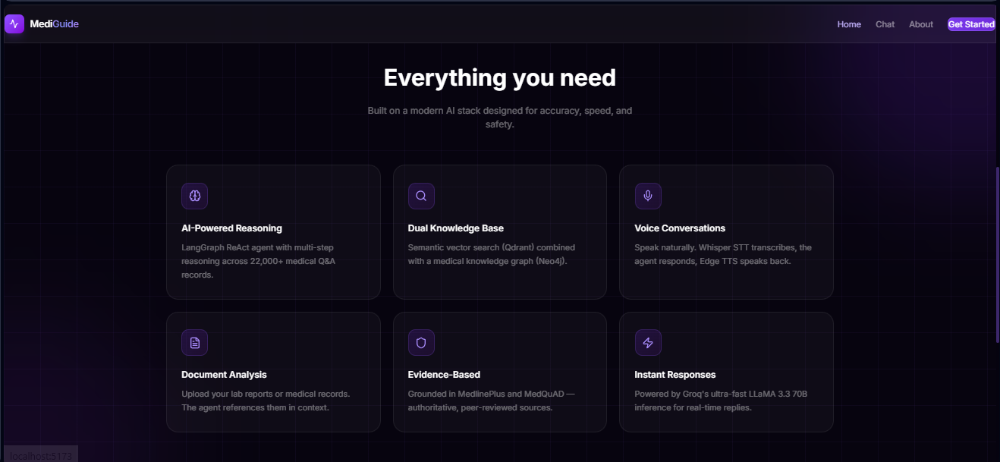
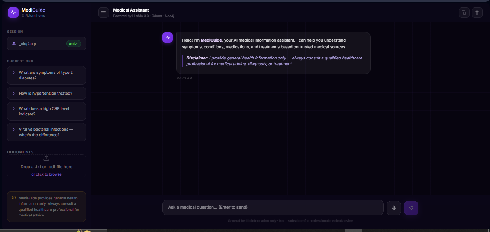
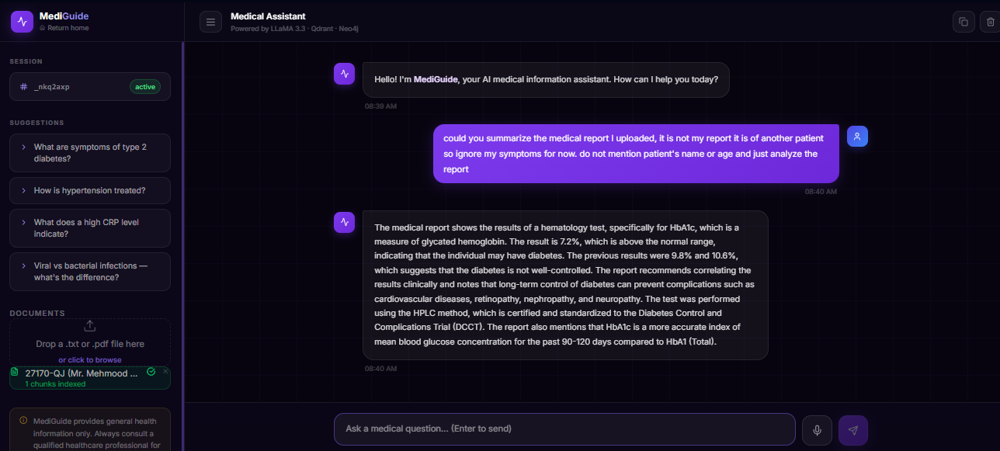
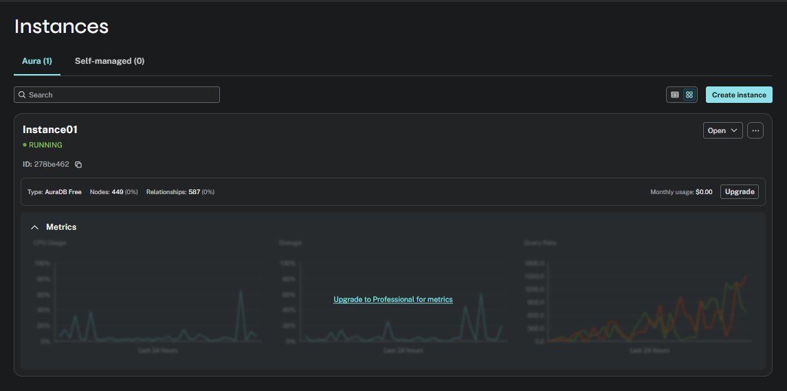
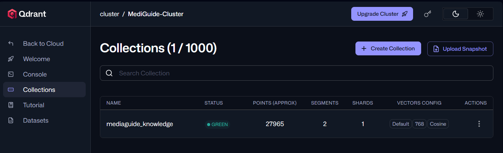

# MediGuide — AI-Powered Medical Assistant

> A conversational medical information assistant that combines Retrieval-Augmented Generation (RAG), a knowledge graph, and voice I/O to answer health questions in plain, spoken language.

---

## Table of Contents

- [Overview](#overview)
- [Screenshots](#screenshots)
- [Features](#features)
- [Tech Stack](#tech-stack)
- [System Architecture](#system-architecture)
- [Data Sources](#data-sources)
- [Ingestion Pipeline](#ingestion-pipeline)
- [Chunking Strategy](#chunking-strategy)
- [Embeddings](#embeddings)
- [Why a Vector Database?](#why-a-vector-database)
- [Why a Graph Database?](#why-a-graph-database)
- [Hybrid DB: How They Work Together](#hybrid-db-how-they-work-together)
- [LangGraph Agent](#langgraph-agent)
- [Voice Pipeline](#voice-pipeline)
- [Document Upload](#document-upload)
- [API Reference](#api-reference)
- [Project Structure](#project-structure)
- [Getting Started](#getting-started)
- [Environment Variables](#environment-variables)

---

## Overview

MediGuide is a full-stack AI health assistant that lets users ask questions about symptoms, conditions, medications, and treatments — by text or by voice. It does not diagnose; it informs. Every response is grounded in two complementary knowledge stores: a **vector database** (Qdrant) holding chunked medical literature, and a **graph database** (Neo4j) encoding structured symptom-condition-treatment relationships. A **LangGraph** agent orchestrates which stores to query on each turn, merges the retrieved context, and sends it to **Llama 3.3 70B** (served via Groq) to generate a concise, TTS-friendly reply. Users can also upload their own medical reports (PDF or TXT) and ask questions against their personal documents within the same session.

---

## Screenshots

### Landing Page





### Chat Interface



### Medical Report Upload



### Neo4j AuraDB — Knowledge Graph



### Qdrant Cloud — Vector Database



### Voice Agent in Action

[](https://youtu.be/CppNc1kRIW8)


---

## Features

| Feature | Description |
|---|---|
| **Conversational Q&A** | Multi-turn text chat with full session memory across the conversation |
| **Symptom Extraction** | LLM automatically identifies symptoms, conditions, age, and medications from natural language |
| **RAG over Medical Literature** | Semantic search over MedlinePlus summaries and MedQuAD Q&A pairs |
| **Knowledge Graph Queries** | Cypher queries over Neo4j to find conditions matching symptoms and treatments for conditions |
| **Hybrid Retrieval** | Qdrant and Neo4j queried together; results merged into a unified context window |
| **Voice Input** | Record audio in the browser; Whisper transcribes it to text |
| **Voice Output** | Every response is synthesized with Microsoft Edge Neural TTS and played back automatically |
| **Full Voice Round-trip** | Single endpoint handles record → transcribe → agent → synthesize → playback |
| **Document Upload** | Upload personal PDF/TXT medical reports; chunks are embedded and scoped to the session |
| **Personal Document RAG** | Uploaded documents are retrieved alongside public knowledge during the same query |
| **Markdown-safe TTS** | All markdown formatting is stripped before speech synthesis for natural audio |
| **Session Persistence** | Conversation history, symptoms, patient context, and uploaded doc IDs persist across turns |

---

## Tech Stack

### Backend

| Layer | Technology |
|---|---|
| API framework | FastAPI 0.111 + Uvicorn |
| LLM | Llama 3.3 70B Versatile via **Groq API** |
| Agent orchestration | **LangGraph** 0.1 (StateGraph) |
| LLM client | LangChain-Groq + LangChain-Core |
| Embedding model | `NeuML/pubmedbert-base-embeddings` (SentenceTransformers, 768-dim) |
| Vector database | **Qdrant Cloud** (cosine similarity) |
| Graph database | **Neo4j AuraDB** (Cypher) |
| Speech-to-text | **faster-whisper** (Whisper `tiny`, CPU, INT8) |
| Text-to-speech | **edge-tts** (Microsoft Edge Neural voices) |
| Data ingestion | MedlinePlus REST API + HuggingFace `datasets` |
| PDF parsing | PyPDF |
| Text splitting | LangChain RecursiveCharacterTextSplitter |
| HTTP client | Requests + HTTPX |

### Frontend

| Layer | Technology |
|---|---|
| Framework | React 19 + TypeScript |
| Build tool | Vite 8 |
| Styling | Tailwind CSS v4 (Vite plugin, inline CSS) |
| Routing | React Router DOM v7 |
| Icons | Lucide React |

### Infrastructure / Cloud

| Service | Purpose |
|---|---|
| Groq Cloud | Fast LLM inference (Llama 3.3 70B) |
| Qdrant Cloud | Managed vector database |
| Neo4j AuraDB | Managed graph database |

---

## System Architecture

```
┌─────────────────────────────────────────────────────────────────────┐
│                         BROWSER (React + TS)                        │
│                                                                     │
│   Landing Page ──────────────────────── Chat Page                  │
│                                          │                          │
│                             ┌────────────┼────────────┐            │
│                             │            │            │            │
│                          Text Chat   Voice I/O   Doc Upload        │
└─────────────────────────────┼────────────┼────────────┼────────────┘
                              │            │            │
                              ▼            ▼            ▼
┌─────────────────────────────────────────────────────────────────────┐
│                        FastAPI (Python)                             │
│                                                                     │
│   POST /api/chat          POST /api/voice/*    POST /api/documents/ │
│         │                       │                     │            │
│         │              ┌────────┴────────┐            │            │
│         │         transcribe         synthesize        │            │
│         │         (Whisper)         (edge-tts)         │            │
│         │              │                │            embed+store   │
│         ▼              ▼                │            (Qdrant)      │
│   ┌─────────────────────────────┐       │                          │
│   │      LangGraph Agent        │       │                          │
│   │                             │       │                          │
│   │  extract_symptoms_node      │       │                          │
│   │         │                   │       │                          │
│   │  decide_tools_node          │       │                          │
│   │     │         │             │       │                          │
│   │  [Qdrant]  [Neo4j]          │       │                          │
│   │     │         │             │       │                          │
│   │  generate_response_node     │       │                          │
│   │     (Groq Llama 3.3 70B)    │       │                          │
│   └─────────────────────────────┘       │                          │
└─────────────────────────────────────────┼────────────────────────-─┘
                    │                     │
        ┌───────────┼────────────┐        │
        ▼           ▼            ▼        ▼
  ┌──────────┐ ┌─────────┐ ┌──────────────────┐
  │  Qdrant  │ │  Neo4j  │ │   Groq (Llama)   │
  │  Cloud   │ │ AuraDB  │ │   Inference API  │
  │          │ │         │ │                  │
  │ 768-dim  │ │Condition│ │  llama-3.3-70b   │
  │ vectors  │ │Symptom  │ │  -versatile      │
  │ cosine   │ │Treatment│ │  temp=0.3        │
  └──────────┘ └─────────┘ └──────────────────┘
```

---

## Data Sources

### 1. MedlinePlus (National Library of Medicine)

- **Source**: `https://wsearch.nlm.nih.gov/ws/query` — the official NLM web service
- **Coverage**: 25 major health topics (diabetes, hypertension, cancer, depression, asthma, COPD, Alzheimer's, Parkinson's, HIV, lupus, and more)
- **Volume**: Up to 45 full topic summaries fetched at ingestion time
- **Format**: HTML full-summaries stripped to plain text via BeautifulSoup, then chunked
- **What's stored**: topic title, source URL, plain-text summary, chunk index

### 2. MedQuAD (Medical Question Answering Dataset)

- **Source**: HuggingFace — `keivalya/MedQuad-MedicalQnADataset`
- **Coverage**: Broad clinical Q&A across hundreds of conditions and question types
- **Volume**: Up to 10,000 question-answer pairs loaded from the train split (~50 MB download on first run)
- **Format**: `Q: <question>\nA: <answer>` concatenated as a single document per pair, then chunked
- **What's stored**: question type as topic, combined Q&A text, chunk index

### 3. Neo4j Graph Seed Data (Hand-curated)

- **50 medical conditions** spanning 8 disease categories:
  - Endocrine (Diabetes T1/T2, Hypo/Hyperthyroidism)
  - Cardiovascular (Hypertension, CAD, Heart Failure, AF, Stroke, DVT)
  - Respiratory (Asthma, COPD, Pneumonia, PE, Tuberculosis)
  - Gastrointestinal (GERD, PUD, Crohn's, UC, IBS, Gallstones, Pancreatitis, Cirrhosis, Hepatitis B/C, Appendicitis)
  - Renal (CKD, UTI)
  - Musculoskeletal (OA, RA, Osteoporosis, Gout, Fibromyalgia, Lupus)
  - Neurological (MS, Parkinson's, Alzheimer's, Epilepsy, Migraine)
  - Mental Health (MDD, GAD, Bipolar, Schizophrenia, ADHD)
  - Infectious (COVID-19, Influenza, HIV/AIDS)
  - Cancer (Breast, Lung, Colorectal, Prostate, Leukemia, Lymphoma)
  - Hematologic (Iron Deficiency Anemia)
- Each condition has **4–8 symptoms** and **3–6 treatments** (with treatment type: medication / procedure / lifestyle / surgery)

---

## Ingestion Pipeline

The pipeline is run once before starting the server. It is **resumable** — a `.pipeline_progress.json` checkpoint file tracks what has completed, so a failed run can pick up from where it stopped without re-uploading data that already succeeded.

```
python -m ingestion.run_pipeline   (run from backend/)
```

```
┌─────────────────────────────────────────────────────────────────┐
│                    Ingestion Pipeline                           │
│                                                                 │
│  1. Ensure Qdrant collection exists (768-dim, cosine)          │
│     Create payload indexes on: source, topic, session_id       │
│                                                                 │
│  2. MedlinePlus Ingestion                                       │
│     ├── Fetch up to 45 docs via NLM API (25 search terms)      │
│     ├── Strip HTML → plain text (BeautifulSoup lxml)           │
│     ├── Chunk (2000 chars, 200 overlap)                         │
│     ├── Embed batch (pubmedbert, batch_size=32)                 │
│     └── Upsert to Qdrant (batch_size=100)                       │
│                                                                 │
│  3. MedQuAD Ingestion                                           │
│     ├── Load 10,000 Q&A pairs from HuggingFace                 │
│     ├── Format: "Q: ...\nA: ..."                               │
│     ├── Chunk (1000 chars, 100 overlap; skip if ≤ 1200 chars)  │
│     ├── Embed in batches of 100                                 │
│     ├── Upload with retry (3x, exponential backoff)            │
│     └── Save batch progress after each batch                   │
│                                                                 │
│  4. Neo4j Graph Ingestion                                       │
│     ├── Create uniqueness constraints (Condition, Symptom,     │
│     │   Treatment nodes)                                        │
│     ├── MERGE 50 Condition nodes                               │
│     ├── MERGE Symptom nodes + INDICATES relationships          │
│     └── MERGE Treatment nodes + TREATED_BY relationships       │
│                                                                 │
│  5. Cleanup progress file on success                           │
└─────────────────────────────────────────────────────────────────┘
```

The pipeline supports `--skip-medlineplus` flag to skip that phase if needed.

---

## Chunking Strategy

Different chunk sizes are used for the two text sources because their documents have very different lengths and structure.

### MedlinePlus Chunks

```
chunk_size    = 2000 characters
chunk_overlap = 200  characters
separators    = ["\n\n", "\n", ". ", " ", ""]
```

MedlinePlus summaries are long, narrative health articles. Larger chunks preserve medical context — a 2000-character window keeps related sentences together (e.g. a description of a disease and its first-line treatments stay in the same chunk). The 200-character overlap ensures that sentences straddling a chunk boundary are not lost.

### MedQuAD Chunks

```
chunk_size    = 1000 characters
chunk_overlap = 100  characters
separators    = ["\n\n", "\n", ". ", " ", ""]
skip if       ≤ 1200 characters (stored as a single chunk)
```

MedQuAD documents are Q&A pairs. Most are already concise (under 1200 characters) so they are stored as-is. Longer answers are split with a smaller window since Q&A pairs are self-contained — there is no need to carry as much overlap across question boundaries.

### User Document Chunks

Uploaded PDFs and TXT files use the same 2000/200 splitter as MedlinePlus. Each chunk is tagged with the session ID and stored in Qdrant with a unique UUID, allowing per-session filtering during retrieval.

---

## Embeddings

**Model**: `NeuML/pubmedbert-base-embeddings`

This is a PubMedBERT model fine-tuned specifically for biomedical semantic similarity. It was chosen over a general-purpose embedding model (e.g. `all-MiniLM`) because:

- Trained on PubMed abstracts — it understands clinical language, drug names, and anatomical terms
- Produces 768-dimensional L2-normalized vectors suitable for cosine similarity search
- Compact enough to run on CPU at inference time without GPU

At query time, the user's question is embedded with the same model and the resulting vector is sent to Qdrant for nearest-neighbor search.

```python
SentenceTransformer("NeuML/pubmedbert-base-embeddings")
# batch_size=32, normalize_embeddings=True
# output: 768-dim float32 list
```

---

## Why a Vector Database?

A **vector database** (Qdrant) stores text chunks as high-dimensional numerical vectors and answers the question *"what passages are semantically closest to this query?"*

### Problem it solves

Medical language is highly paraphrastic. A user asking *"I keep feeling dizzy and can't catch my breath"* should match a document describing *"vertigo and dyspnea"*. Keyword search fails here. Cosine similarity over embeddings succeeds because the meaning is preserved in the vector space even when the words are different.

### How Qdrant is used in MediGuide

- **Collection**: `mediaguide_knowledge` — a single shared collection holding all public knowledge and user uploads
- **Distance**: Cosine (vectors are L2-normalized, so cosine ≡ dot-product)
- **Vector size**: 768 (pubmedbert output)
- **Payload fields**: `source` (medlineplus / medquad / user_upload), `topic`, `text`, `url`, `session_id`, `chunk_index`, `total_chunks`
- **Payload indexes**: keyword indexes on `source`, `topic`, `session_id` for filtered search
- **Public knowledge search**: top-5 hits from the full collection, no filter
- **Personal document search**: top-3 hits filtered to only the UUIDs uploaded by the current session (`HasIdCondition`)

---

## Why a Graph Database?

A **graph database** (Neo4j) models entities and their relationships explicitly, answering the question *"what conditions are associated with these symptoms?"* and *"what treatments exist for this condition?"*

### Problem it solves

Vector search returns semantically similar passages — it does not reason over structured relationships. When a user says *"I have a fever, night sweats, and unintended weight loss"*, you need structured lookup: which conditions simultaneously match all three of those symptoms? A graph can answer this with a single Cypher traversal. A vector database would require the symptoms to appear together in the same chunk, which is unreliable.

### Graph Schema

```
(:Symptom)-[:INDICATES]->(:Condition)-[:TREATED_BY]->(:Treatment)

Node labels and key properties:
  Condition  { name, description }
  Symptom    { name }
  Treatment  { name, type }         // type: medication | procedure | lifestyle | surgery

Constraints (unique per node type):
  Condition.name IS UNIQUE
  Symptom.name   IS UNIQUE
  Treatment.name IS UNIQUE
```

### Cypher queries used at runtime

**Symptom → Condition lookup** (finds conditions matching the most symptoms):
```cypher
UNWIND $symptoms AS symptomName
MATCH (s:Symptom)-[:ASSOCIATED_WITH]->(c:Condition)
WHERE toLower(s.name) CONTAINS toLower(symptomName)
WITH c, count(DISTINCT s) AS matchCount
ORDER BY matchCount DESC
RETURN c.name, c.description, matchCount LIMIT 5
```

**Condition → Treatment lookup**:
```cypher
MATCH (c:Condition)-[:TREATED_BY]->(t:Treatment)
WHERE toLower(c.name) CONTAINS toLower($condition)
RETURN c.name, t.name, t.description LIMIT 10
```

---

## Hybrid DB: How They Work Together

The two databases are complementary, not redundant. Neither alone is sufficient:

| Capability | Qdrant (Vector) | Neo4j (Graph) |
|---|---|---|
| Semantic similarity | Yes | No |
| Paraphrase matching | Yes | No |
| Long-form medical text | Yes | No |
| Structured symptom lookup | No | Yes |
| Multi-hop relationships | No | Yes |
| Counting symptom matches | No | Yes |
| Personal document search | Yes | No |

### Query routing at runtime

The LangGraph `decide_tools_node` uses the LLM to decide which stores to query on each turn:

```
use_qdrant = true   → always for medical questions (semantic search over literature)
use_neo4j  = true   → when symptoms have been mentioned OR condition name is in the question
use_qdrant = false  → only for pure greetings with no health content
```

When both are active, Qdrant is queried first, then Neo4j, and both results are merged into the context block sent to the LLM:

```
[Retrieved Context]
Medical Knowledge:            ← Qdrant passages (source, topic, text)
  1. [medlineplus] Diabetes
     Type 2 diabetes is...
  2. [medquad] treatment
     Q: What medications...

Condition and Treatment Info: ← Neo4j structured results
  Conditions related to symptoms: fatigue, frequent urination
    Type 2 Diabetes (matches 2 symptoms): Metabolic disorder...
  Treatments for diabetes:
    Metformin: ...
    Low-carbohydrate diet: ...
```

This hybrid approach means every response is grounded in both narrative medical knowledge (for nuance and explanation) and structured clinical facts (for accuracy on symptom-condition-treatment mappings).

---

## LangGraph Agent

The agent is implemented as a **LangGraph StateGraph** — a directed graph of async Python nodes where each node reads from and writes back to a shared typed state dictionary (`MediGuideState`).

### State schema

```python
class MediGuideState(TypedDict):
    messages:          list        # full conversation history (HumanMessage / AIMessage)
    symptoms_mentioned: list       # deduplicated symptoms accumulated across the session
    patient_context:   dict        # age, existing conditions, medications (if mentioned)
    session_id:        str
    current_query:     str         # the current user message
    neo4j_context:     str         # Neo4j output for this turn
    qdrant_context:    str         # Qdrant output for this turn
    uploaded_doc_ids:  list        # Qdrant point UUIDs scoped to this session
    final_response:    str
    tool_plan:         dict        # routing decision from decide_tools_node
```

### Node flow

```
                    ┌─────────────────┐
     User message ──► extract_symptoms │  LLM extracts symptoms & patient info
                    └────────┬────────┘  from current query + recent history
                             │
                    ┌────────▼────────┐
                    │  decide_tools   │  LLM decides: use_qdrant? use_neo4j?
                    └────────┬────────┘
                             │
              ┌──────────────┼──────────────┐
         use_qdrant     use_neo4j only    neither
              │                │              │
     ┌────────▼────────┐       │    ┌─────────▼────────┐
     │  query_qdrant   │       │    │ generate_response │
     └────────┬────────┘       │    └──────────────────-┘
              │                │
      use_neo4j?──yes──►  ┌────▼────────────┐
              │           │  query_neo4j    │
           no │           └────────┬────────┘
              │                    │
     ┌────────▼────────────────────▼────────┐
     │          generate_response           │  Groq Llama 3.3 70B
     │  system prompt + history + context   │  temp=0.3
     └──────────────────────────────────────┘
```

### Key design decisions

- **Session isolation**: each `session_id` maps to its own state dict (in-memory; production would use Redis)
- **Symptom accumulation**: symptoms are merged and deduplicated across turns using a lowercase-keyed dict, so the agent remembers what the user mentioned two messages ago
- **Conversational context**: last 6 messages from history are passed to `extract_symptoms_node` so it understands pronouns and references ("it" = the symptom from the previous message)
- **System prompt is TTS-aware**: explicitly forbids markdown, bullets, and headers because output is spoken aloud
- **Response length is bounded**: 2–4 sentences for simple questions, 6–8 max for complex ones, to keep audio clips short
- **Context is cleared after each turn**: `qdrant_context` and `neo4j_context` are reset to `""` after response generation to prevent stale context bleeding into the next turn

---

## Voice Pipeline

### Speech-to-Text (STT)

**Model**: `faster-whisper` — a CTranslate2-optimized port of OpenAI Whisper

```
Configuration:
  model size : tiny
  device     : cpu
  compute    : int8 quantization
  beam_size  : 5
  input      : .webm audio (captured from MediaRecorder API in browser)
```

The browser captures microphone audio via the `MediaRecorder` API and sends the `.webm` blob to `POST /api/voice/transcribe`. The backend writes it to a temp file, transcribes it, then deletes the temp file.

The `tiny` model was chosen for fast local inference on CPU — it transcribes a typical 5-second voice question in under 2 seconds. Accuracy is sufficient for clear spoken English medical queries.

### Text-to-Speech (TTS)

**Engine**: `edge-tts` — unofficial Python wrapper for Microsoft Edge's neural TTS service

```
Available voices:
  en-US-JennyNeural    (default)
  en-US-AriaNeural
  en-US-GuyNeural
  en-GB-SoniaNeural
  en-AU-NatashaNeural
```

Before synthesis, a `strip_markdown()` function removes all markdown formatting (bold, italics, headers, bullets, numbered lists, code blocks, links) so the spoken output sounds natural. The output is streamed chunk-by-chunk from the edge-tts API and returned as raw MP3 bytes.

### Full Voice Conversation Round-trip

`POST /api/voice/conversation` handles the entire cycle in one request:

```
Browser records audio
       │
       ▼
POST /api/voice/conversation  (multipart: audio file + session_id)
       │
       ├─► transcribe_audio()    →  transcript text
       ├─► run_agent()           →  response text (LangGraph)
       └─► synthesize_speech()   →  MP3 bytes → base64
       │
       ▼
JSON response:
  { session_id, transcript, response, audio_b64 }
       │
       ▼
Browser decodes base64 → Audio element → auto-plays response
```

---

## Document Upload

Users can upload personal medical reports during a session. The flow:

```
POST /api/documents/upload  (multipart: file + session_id)
       │
       ├─► Extract text (pypdf for PDF, UTF-8 decode for TXT)
       ├─► Chunk with MedlinePlus splitter (2000/200)
       ├─► Embed all chunks (pubmedbert)
       ├─► Assign unique UUIDs per chunk
       ├─► Upsert to Qdrant with session_id in payload
       └─► Register UUIDs in session's doc_ids list
       │
       ▼
Response: { session_id, doc_id, filename, chunks_stored }
```

On subsequent queries within the same session, the agent's `query_qdrant_node` calls `search_patient_documents()` with those UUIDs using Qdrant's `HasIdCondition` filter, so only the user's own documents are searched. Public knowledge and personal documents are retrieved in the same Qdrant call and merged before being sent to the LLM.

---

## API Reference

| Method | Endpoint | Description |
|---|---|---|
| `GET` | `/` | Health check |
| `POST` | `/api/chat` | Send a text message; returns AI response |
| `POST` | `/api/voice/transcribe` | Upload audio file; returns transcript |
| `POST` | `/api/voice/synthesize` | Send text; returns MP3 audio bytes |
| `POST` | `/api/voice/conversation` | Full voice round-trip (transcribe + agent + synthesize) |
| `POST` | `/api/documents/upload` | Upload PDF or TXT medical report |

### `POST /api/chat`

```json
Request:  { "session_id": "abc123", "message": "I have a sore throat and fever" }
Response: { "session_id": "abc123", "response": "Those symptoms can be..." }
```

### `POST /api/voice/conversation`

```
Request: multipart/form-data
  audio      : <audio file .webm>
  session_id : "abc123"

Response:
{
  "session_id" : "abc123",
  "transcript" : "I have a sore throat",
  "response"   : "A sore throat with fever can indicate...",
  "audio_b64"  : "<base64-encoded MP3>"
}
```

### `POST /api/documents/upload`

```
Request: multipart/form-data
  file       : <PDF or TXT>
  session_id : "abc123"

Response:
{
  "session_id"    : "abc123",
  "doc_id"        : "<uuid of first chunk>",
  "filename"      : "bloodwork.pdf",
  "chunks_stored" : 4
}
```

---

## Project Structure

```
MediGuide/
├── .env.example                  # Environment variable template
├── README.md
│
├── backend/
│   ├── requirements.txt
│   ├── main.py                   # FastAPI app, lifespan (DB + model warmup)
│   ├── config.py                 # Settings loaded from .env
│   ├── run.py                    # Uvicorn entrypoint
│   │
│   ├── agent/
│   │   ├── graph.py              # LangGraph StateGraph definition + run_agent()
│   │   ├── state.py              # MediGuideState TypedDict
│   │   ├── prompts.py            # System prompt
│   │   └── tools.py              # Qdrant + Neo4j retrieval functions
│   │
│   ├── api/
│   │   ├── models.py             # Pydantic request/response models
│   │   └── routes/
│   │       ├── chat.py           # POST /api/chat
│   │       ├── voice.py          # POST /api/voice/*
│   │       └── documents.py      # POST /api/documents/upload
│   │
│   ├── db/
│   │   ├── neo4j_client.py       # Neo4j driver singleton
│   │   └── qdrant_client.py      # Qdrant client singleton
│   │
│   ├── ingestion/
│   │   ├── run_pipeline.py       # Orchestrates full ingestion (resumable)
│   │   ├── fetch_medlineplus.py  # NLM API fetcher
│   │   ├── fetch_medquad.py      # HuggingFace dataset loader
│   │   ├── chunker.py            # Source-specific text splitters
│   │   ├── embedder.py           # PubMedBERT SentenceTransformer wrapper
│   │   ├── vector_store.py       # Qdrant collection setup + upsert
│   │   └── graph_loader.py       # Neo4j graph seed data + loader
│   │
│   └── voice/
│       ├── stt.py                # faster-whisper transcription
│       └── tts.py                # edge-tts synthesis + markdown stripping
│
├── frontend/
│   ├── index.html
│   ├── package.json
│   ├── vite.config.ts
│   ├── tsconfig.json
│   └── src/
│       ├── App.tsx               # Router: Landing + Chat pages
│       ├── pages/
│       │   ├── Landing.tsx
│       │   └── Chat.tsx
│       └── components/
│           └── Navbar.tsx
│
├── data/
│   └── .gitkeep                  # Placeholder; data files are gitignored
│
└── Screenshots/
    ├── landing-page1.PNG
    ├── landing-page2.PNG
    ├── landing-page3.PNG
    ├── chat-interface.PNG
    ├── medical-report-upload.PNG
    ├── neo4j-auradb-graphdb.PNG
    ├── qdrant-vectordb.PNG
    └── voice-agent.mp4
```

---

## Getting Started

### Prerequisites

- Python 3.11+
- Node.js 18+
- A **Qdrant Cloud** account — free tier works ([cloud.qdrant.io](https://cloud.qdrant.io))
- A **Neo4j AuraDB** account — free tier works ([console.neo4j.io](https://console.neo4j.io))
- A **Groq** API key — free tier works ([console.groq.com](https://console.groq.com))

---

### 1. Clone the Repository

```bash
git clone https://www.github.com/mediguide.git
cd mediguide
```

---

### 2. Backend Setup

```bash
cd backend

# Create and activate a virtual environment
python -m venv venv

# Windows
venv\Scripts\activate

# macOS / Linux
source venv/bin/activate

# Install dependencies
pip install -r requirements.txt
```

---

### 3. Configure Environment Variables

Copy the example file and fill in your credentials:

```bash
cp .env.example .env
```

Edit `.env` with your values (see [Environment Variables](#environment-variables) below).

---

### 4. Run the Ingestion Pipeline

This must be run **once** before starting the server. It populates Qdrant and Neo4j.

```bash
# From the backend/ directory, with venv active
python -m ingestion.run_pipeline
```

Expected output:

```
Starting MediGuide ingestion pipeline...
Qdrant collection 'mediaguide_knowledge' ready

=== MedlinePlus Ingestion ===
  'diabetes': +3 new  (total 3)
  ...
Fetched 45 MedlinePlus documents
Created 187 chunks
Uploaded 187 chunks to Qdrant

=== MedQuAD Ingestion ===
  Loading MedQuAD dataset from HuggingFace...
Loaded 10000 MedQuAD documents
Embedding & uploading: 100%|████████████| 100/100
Uploaded 9843 MedQuAD chunks to Qdrant

=== Neo4j Graph Ingestion ===
  Creating Neo4j constraints...
  Loading 50 conditions into Neo4j...
  Graph ready — 50 conditions, 243 symptoms, 187 treatments

Ingestion pipeline complete in 412.3s
```

If the pipeline is interrupted, re-run the same command — it will resume from the last completed batch automatically.

To skip MedlinePlus (if already ingested):

```bash
python -m ingestion.run_pipeline --skip-medlineplus
```

---

### 5. Start the Backend

```bash
# From the backend/ directory
python run.py
```

The API will be available at `http://localhost:8000`. You should see:

```
INFO: Qdrant connected successfully
INFO: Neo4j connected successfully
INFO: Embedding model loaded successfully
INFO: Uvicorn running on http://0.0.0.0:8000
```

---

### 6. Start the Frontend

Open a new terminal:

```bash
cd frontend
npm install
npm run dev
```

The UI will be available at `http://localhost:5173`.

---

### 7. Use the App

1. Open `http://localhost:5173` in your browser
2. Click **Start Chatting** to go to the chat interface
3. Type a medical question or click the microphone button to speak
4. Optionally upload a medical report PDF or TXT via the upload button
5. The assistant's response is displayed as text and played back as audio automatically

---

## Environment Variables

Create a `.env` file in the project root (same level as `backend/` and `frontend/`):

```env
# ── Groq (LLM inference) ───────────────────────────────────
GROQ_API_KEY=gsk_...

# ── Qdrant Cloud (vector database) ────────────────────────
QDRANT_URL=https://your-cluster.qdrant.io
QDRANT_API_KEY=your-qdrant-api-key
QDRANT_COLLECTION_NAME=mediaguide_knowledge

# ── Neo4j AuraDB (graph database) ─────────────────────────
NEO4J_URI=neo4j+s://xxxxxxxx.databases.neo4j.io
NEO4J_USERNAME=neo4j
NEO4J_PASSWORD=your-neo4j-password
NEO4J_DATABASE=neo4j

# ── CORS (frontend origin) ─────────────────────────────────
CORS_ORIGINS=http://localhost:5173,http://127.0.0.1:5173
```

| Variable | Where to find it |
|---|---|
| `GROQ_API_KEY` | [console.groq.com](https://console.groq.com) → API Keys |
| `QDRANT_URL` | Qdrant Cloud dashboard → your cluster → Connection URL |
| `QDRANT_API_KEY` | Qdrant Cloud dashboard → your cluster → API Keys |
| `NEO4J_URI` | Neo4j AuraDB console → your instance → Connection URI |
| `NEO4J_USERNAME` | Always `neo4j` for AuraDB free tier |
| `NEO4J_PASSWORD` | Set when you created the AuraDB instance |

---

## Notes

- **No diagnosis**: MediGuide provides health information only. It always recommends consulting a qualified healthcare professional for diagnosis or treatment decisions.
- **Session memory**: Conversation state is held in-memory on the server process. Restarting the server clears all sessions. For production, replace the `sessions` dict in `agent/graph.py` with a Redis-backed store.
- **Voice browser support**: The MediaRecorder API requires a modern browser (Chrome, Edge, Firefox). Safari has limited support.
- **Whisper model**: The `tiny` Whisper model runs on CPU without a GPU. For better transcription accuracy, change `"tiny"` to `"base"` or `"small"` in `voice/stt.py` at the cost of higher latency.
- **Neo4j Windows TLS**: The Neo4j client in `db/neo4j_client.py` automatically rewrites `neo4j+s://` to `neo4j+ssc://` to bypass certificate verification issues common on Windows with AuraDB.
